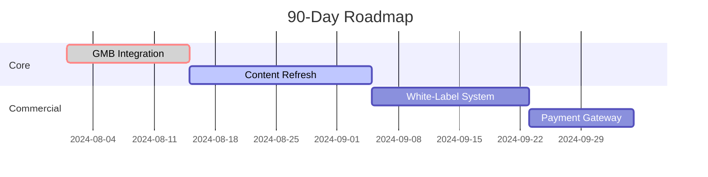

# Website Builder Bot

A comprehensive website building automation system with advanced SEO capabilities, cost management, and review handling.

## Project Structure

```
WebsiteBuilderBot/
├── bot_core/                    # Core bot functionality
│   ├── seo/                    # SEO automation system
│   │   ├── __init__.py        # Package initialization
│   │   ├── automation.py      # Main SEO interface
│   │   ├── sentinel.py        # SEO monitoring
│   │   ├── cost_governor.py   # Budget management
│   │   ├── review_manager.py  # Review handling
│   │   ├── gmb_manager.py     # Google My Business automation
│   │   └── content_refresh.py # AI content freshness monitoring
│   ├── compliance/            # Legal compliance tools
│   │   ├── gdpr.py           # GDPR automation
│   │   ├── ccpa.py           # CCPA compliance
│   │   └── ada.py            # Accessibility tools
│   ├── monitoring/            # System monitoring
│   │   ├── uptime.py         # Uptime tracking
│   │   └── performance.py     # Performance metrics
│   ├── security/             # Security features
│   │   ├── waf.py           # Web Application Firewall
│   │   └── rate_limiter.py  # API rate limiting
│   ├── localization/         # Multi-language support
│   │   ├── translator.py    # Content translation
│   │   └── locale_manager.py # Locale handling
│   ├── commercial/          # Business features
│   │   ├── stripe.py       # Payment processing
│   │   └── billing.py      # Usage billing
│   ├── templates/           # Website templates
│   │   ├── design_libraries/
│   │   │   ├── tailwind-basic/
│   │   │   ├── tailwind-daisyui/
│   │   │   └── custom-css/
│   ├── ai/                  # AI integration
│   ├── deployment/         # Deployment automation
│   ├── builder.py         # Website generation
│   └── config.json        # Global configuration
├── docs/                  # Documentation
├── scripts/               # Automation scripts
│   ├── setup.sh          # Initial setup
│   ├── deploy.sh         # Deployment
│   ├── update-deps.sh    # Dependencies
│   ├── export-client.sh  # Client export
│   └── vps_setup/        # VPS configuration
│       ├── hetzner_init.sh   # Server initialization
│       ├── deploy_nginx.sh   # Nginx setup
│       ├── ssl_init.sh       # SSL configuration
│       └── harden.sh         # Security hardening
└── requirements.txt      # Dependencies

```

## Core Components

### 1. Website Builder
The website builder module provides template-based website generation:

#### Template System
- **Design Libraries**
  - Tailwind Basic (CDN option)
  - Tailwind + DaisyUI
  - Custom CSS
- **Component Management**
  - Reusable UI components
  - Theme configuration
  - Asset optimization

#### Builder Features
- Generate websites from templates
- Dynamic content injection
- Automated asset management
- Independent repository creation
- Multi-site project management

### 2. SEO Automation System
The SEO module provides comprehensive SEO management:

#### SEO Sentinel (`sentinel.py`)
- **Automated Monitoring**
  - Traffic drop detection (>15% threshold)
  - CTR analysis (2.5-8% range)
  - Content freshness monitoring (90 days)
  - Keyword density optimization (0.8-1.2%)
- **Issue Detection & Resolution**
  - Automated remediation
  - Human escalation
  - Ticket creation

#### Google My Business Manager (`gmb_manager.py`)
- **Automated Post Management**
  - Schedule and publish posts
  - Monitor engagement metrics
  - Sync reviews automatically
- **Review Management**
  - Auto-response system
  - Engagement tracking
  - Review-to-content repurposing

#### Content Refresh System (`content_refresh.py`)
- **AI-Powered Monitoring**
  - Content decay detection
  - Google HCU compliance checks
  - Update recommendations
- **Automated Updates**
  - Smart content refreshing
  - Keyword optimization
  - Competitor analysis

### 3. AI Integration (`ai/`)
- **Content Generation**
  - SEO-optimized writing
  - Image creation
  - Meta description generation
- **Content Humanization**
  - Natural language enhancement
  - Style variation
  - Brand voice consistency
- **Cost Management**
  - Budget tracking
  - Usage optimization
  - ROI analysis

## Maintenance & Sustainability

### Monthly Maintenance
```bash
# Generate SEO performance report
npm run seo-report

# Refresh outdated content
python bot.py refresh-content

# Update dependencies securely
./scripts/update-deps.sh
```

### Content Freshness Monitoring
```python
# Check content against latest Google guidelines
freshness_score = ai_client.seo.analyze(url).freshness_score

# Auto-refresh if needed
if freshness_score < 0.7:
    content_refresh.update(url)
```

### Security & Updates
- Automated dependency scanning
- Weekly security patches
- Performance optimization

## Client Deployment

### White-Labeling
```bash
# Configure for client
python white_label.py --client="Acme Corp" --color=#FF0000

# Export client package
./scripts/export-client-site.sh acme-corp
```

### Handoff Protocol
1. Brand configuration
2. Domain setup
3. Analytics integration
4. Client dashboard setup

## Cost Control System

### AI Usage Monitoring
```python
from bot_core.ai.cost_tracker import AISpendMonitor

monitor = AISpendMonitor(monthly_budget=200)
if monitor.can_afford(task):
    execute_ai_task(task)
```

### Budget Management
- Per-client cost tracking
- Usage optimization
- ROI reporting

## Risk Mitigation

### Content Protection
- AI detection avoidance
- Template obfuscation
- Code protection

### Google Updates
- HCU compliance monitoring
- Algorithm change detection
- Automated adjustments

## Commercialization Roadmap

### Phase 1 (Current) ✅
- Template system
- Basic AI content
- SEO automation

### Phase 2 (Next 6 Months)
- Multi-client support
- White-label system
- Payment integration
- Client dashboard

### Phase 3 (12 Months)
- Template marketplace
- SEO subscriptions
- GMB automation service
- Advanced analytics

## Development Timeline



## Getting Started

### Prerequisites
- Python 3.8+
- Git
- GitHub account

### Installation
1. Clone the repository
```bash
git clone https://github.com/wikatar/websitebuilder.git
cd websitebuilder
```

2. Create and activate virtual environment
```bash
python -m venv venv
source venv/bin/activate  # On Windows: venv\Scripts\activate
```

3. Install dependencies
```bash
pip install -r requirements.txt
```

### Configuration
1. Set up configuration files:
   - `bot_core/config.json` - Global bot configuration
   - `config/seo_thresholds.json` - SEO monitoring thresholds
   - `config/review_templates.json` - Review response templates

2. Configure logging:
   - Create `logs/` directory
   - Separate logs for each component

## Usage Examples

### Website Generation
```python
from bot_core.builder import WebsiteBuilder

builder = WebsiteBuilder()
config = {
    "title": "My Website",
    "design_library": "tailwind-daisyui",
    "theme": "light",
    "components": ["navbar", "footer", "hero"]
}
builder.create_website("my-website", config)
```

### SEO Automation
```python
from bot_core.seo import SEOAutomation

seo = SEOAutomation(
    business_id="your_business_id",
    monthly_budget=5000
)

# Run automated tasks
results = seo.run_automated_tasks()

# Handle results
if results['pending_actions']:
    for action in results['pending_actions']:
        if action['type'] == 'review_escalation':
            handle_review_escalation(action)
        elif action['type'] == 'seo_issue':
            handle_seo_issue(action)
```

## Development Workflow

### Template Development
1. Choose design library
2. Create components
3. Test with sample content
4. Document usage

### SEO Feature Development
1. Update monitoring thresholds
2. Test automation rules
3. Validate cost calculations
4. Document changes

## Quality Gates

### Code Quality
- PEP 8 compliance
- Type hints
- Error handling
- Detailed logging

### SEO Quality
- Content requirements
- Response times
- Budget controls
- Monitoring thresholds

## Future Enhancements

1. **Website Builder**
   - More design libraries
   - Plugin system
   - Visual editor
   - Performance optimization

2. **SEO Capabilities**
   - AI content analysis
   - Citation automation
   - Schema generation

3. **Integration**
   - Analytics dashboard
   - Automated reporting
   - Multi-site management

## Contributing

1. Fork the repository
2. Create your feature branch
3. Commit your changes
4. Push to the branch
5. Create a Pull Request

## License

This project is licensed under the MIT License - see the LICENSE file for details.

## Production Infrastructure

### Infrastructure Overview
```
infrastructure/
├── base/           # One-time server setup
│   └── hetzner     # Base Hetzner configuration
└── project/        # Per-website deployment
    └── sites/      # Individual site configs
```

### Base Infrastructure Setup
The base setup is done once per server and creates a reusable foundation:

```bash
# Initialize base server
./scripts/vps_setup/base/hetzner_init.sh --server-ip=X.X.X.X
```

This sets up:
- Nginx with optimized configuration
- SSL certificate management
- Security hardening (firewall, fail2ban)
- Log rotation
- Backup system
- Multi-site directory structure

### Per-Website Deployment
Each website can be deployed using our standardized script:

```bash
# Deploy a new website
./scripts/vps_setup/project/deploy_site.sh \
    --domain=example.com \
    --template=business \
    --ssl=true
```

Features:
- Automated Nginx configuration
- SSL certificate setup
- Template deployment
- Security headers
- Logging setup
- Backup configuration

### Directory Structure
```
/var/www/
├── websites/                # Live websites
│   ├── example.com/
│   │   ├── public_html/    # Website files
│   │   ├── logs/          # Site-specific logs
│   │   └── backup/        # Local backups
│   └── another-site.com/
└── templates/              # Website templates
    ├── business/
    └── blog/
```

## Compliance Automation

### GDPR Compliance
- Automated cookie consent
- Privacy policy generator
- Data export/deletion tools
- Consent management

### CCPA Implementation
- Privacy notice generator
- Opt-out mechanisms
- Data inventory tools
- Request handling system

### ADA Compliance
- Automated accessibility scans
- WCAG 2.1 validation
- Screen reader optimization
- Color contrast checking

## Security Measures

### Rate Limiting
```python
from bot_core.security.rate_limiter import AIMeter

meter = AIMeter()
limits = {
    'gpt4': (1000, 'day'),    # 1k requests/day
    'dalle': (50, 'hour')     # 50 requests/hour
}
```

### Client Isolation
```yaml
# Per-client database configuration
CLIENT_db_1:
  image: postgres:15
  volumes:
    - client1_data:/var/lib/postgresql/data
```

## Support Protocol

### Tiered Support System
1. **Tier 1: AI Chatbot**
   - 24/7 automated support
   - Common issue resolution
   - Documentation access

2. **Tier 2: Community Forum**
   - Peer support
   - Knowledge sharing
   - Feature requests

3. **Tier 3: Paid Support**
   - Direct technical assistance
   - Custom development
   - Priority issue resolution

## Client Onboarding

### Process Flow
1. Brand questionnaire completion
2. AI configuration generation
3. Domain auto-configuration
4. Compliance setup
5. Documentation handoff

### Automation Example
```python
from bot_core.commercial.onboarding import ClientOnboarding

onboarding = ClientOnboarding()
setup = onboarding.initialize_client(
    brand_data=questionnaire.responses,
    domain="client-domain.com",
    plan="enterprise"
)
```

## Template System

### Business Template
The business template provides a modern, responsive design with built-in SEO optimization and analytics integration.

#### Core Components
1. **Header**
   - Responsive navigation menu
   - Mobile-friendly hamburger menu
   - Dynamic company branding
   - Customizable navigation links
   - Call-to-action button

2. **Footer**
   - Company information section
   - Social media integration
   - Service links
   - Legal links
   - Dynamic copyright year

3. **Hero Section**
   - Animated background with blob effect
   - Image support with responsive layout
   - Dual call-to-action buttons
   - Stats display
   - Mobile-optimized design

#### Template Configuration
```json
{
    "framework": {
        "name": "tailwind",
        "version": "3.4.0",
        "plugins": ["daisyui"]
    },
    "components": {
        "required": ["header", "footer", "hero"],
        "optional": ["testimonials", "services", "contact", "about"]
    }
}
```

#### Customization Options
- **Theme Colors**: Primary, secondary, accent colors
- **Typography**: Customizable fonts for headings and body text
- **Layout**: Flexible component arrangement
- **Content**: Dynamic content injection via variables
- **Analytics**: Built-in event tracking

#### SEO Features
- Meta tag templates
- Required section validation
- Schema.org markup
- Social media meta tags
- Performance optimization

## Monitoring System

### Uptime Monitoring
The system performs comprehensive health checks:

```python
from bot_core.monitoring import UptimeMonitor

monitor = UptimeMonitor()
status = monitor.check_site("example.com")
```

Features:
- HTTP/HTTPS endpoint monitoring
- SSL certificate validation
- DNS record verification
- Response time tracking
- Custom alert thresholds

### Performance Metrics
```python
# Get detailed uptime statistics
stats = monitor.get_uptime_stats("example.com", days=30)
print(f"Uptime: {stats['uptime_percentage']}%")
```

## Backup System

### Daily Backups
Automated daily backup system with retention policies:

```bash
# Backup a specific site
./scripts/backup/daily_backup.sh --site=example.com
```

Features:
- Website files backup
- Nginx configuration backup
- SSL certificate backup
- 7-day retention policy
- Backup manifest generation
- Latest backup symlink

### Backup Structure
```
/var/backups/websites/
├── example.com/
│   ├── 20240122/           # Daily backup
│   │   ├── files.tar.gz    # Website files
│   │   ├── nginx.conf      # Nginx config
│   │   ├── ssl/            # SSL certificates
│   │   └── manifest.json   # Backup metadata
│   └── latest -> 20240122  # Symlink to latest
```

